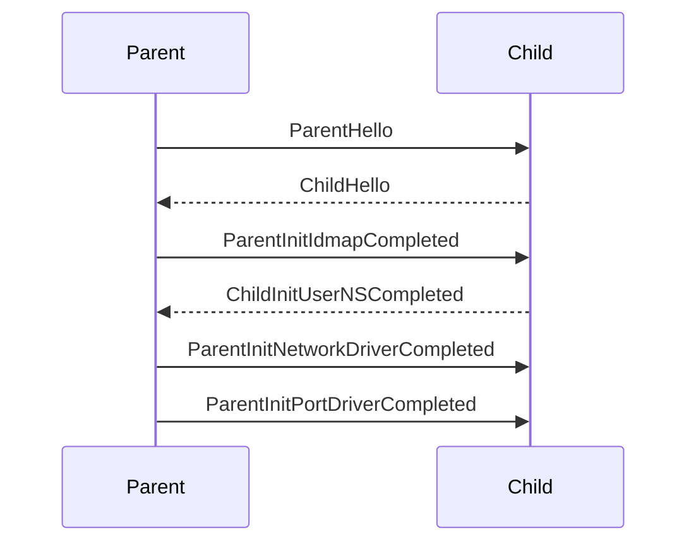

# Internal data structure

## State dir
Common:
- `lock`
- `child_pid`
- `api.sock`
- `netns` (detached netns)

Network driver `slirp4netns`:
- `.s4nn.sock`

Port driver `builtin`:
- `.bp.sock`
- `.bp-ready.pipe`

## Parent-child communication

